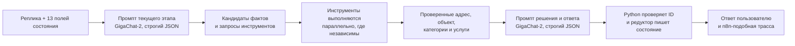

# ИИ-агент, инструменты и поиск по каталогу

## Главный вывод

Из лабораторного ноутбука берём полезный принцип: у этапов разные короткие
промпты, а маршрут и изменение состояния остаются в Python. Не переносим его
текстовые блоки `[SIGNAL: ...]` и разбор регулярными выражениями: GigaChat
теперь умеет строгий структурированный ответ по JSON-схеме.

Официальная документация на 20 июля 2026 года подтверждает
`response_format.type=json_schema` и `strict=true`. Важная деталь: в REST v1
JSON всё равно приходит строкой в `message.content`, поэтому приложение
обязано разобрать её и проверить Pydantic-схемой. Поддержка была описана
18 июня, а не впервые в июле; в июле документацию обновили и перевели
подключение на единый адрес `https://api.giga.chat`.

Источники:

- [GigaChat: структурированные данные](https://developers.sber.ru/docs/ru/gigachat/guides/structured-output)
- [GigaChat: пользовательские функции](https://developers.sber.ru/docs/ru/gigachat/guides/functions/generating-arguments-for-custom-functions)
- [GigaChat: выбор быстрой модели](https://developers.sber.ru/docs/ru/gigachat/guides/selecting-a-model)
- [GigaChat: векторное представление текста](https://developers.sber.ru/docs/ru/gigachat/guides/embeddings)

## Как устроен один ход



Обычный ход использует один или два последовательных вызова GigaChat:

1. промпт этапа понимает новую реплику и формирует аргументы инструментов;
2. после инструментов промпт решения выбирает только из найденных ID и пишет
   живой ответ.

Если на ходе уже нет новых фактов, первый вызов не нужен. До пяти независимых
малых запросов допустимы параллельно, но архитектура не создаёт их ради
красивой схемы. Один повтор структурированного ответа разрешён только после
ошибки проверки JSON и отдельно попадает в журнал.

## Этапные промпты

| Код промпта | Когда работает | Что возвращает |
|---|---|---|
| `intake.start` | начало/свободная реплика | найденные адрес, имя, контакт, описание |
| `address.resolve` | адрес ещё не подтверждён | цельная строка адреса, названная УК, что надо уточнить |
| `catalog.classify` | есть описание проблемы | поисковый текст и кандидаты типа/локализации |
| `contact.collect` | не хватает имени или контакта | кандидат имени и нормализуемый контакт |
| `request.confirm` | показано резюме | подтверждение, исправления или отказ |
| `reply.compose` | инструменты завершены | цель ответа, живой текст, признак завершения |

Каждый промпт получает только нужные поля текущего этапа, последние 2–4
реплики и результаты инструментов этого хода. Он не получает секреты,
внутренние заметки оператора и весь журнал сессии.

## Инструменты агента

### 1. `resolve_fias_address`

Получает цельный текст полного или частичного адреса. Возвращает кандидатов
ФИАС с ролями города, улицы, дома и устойчивыми идентификаторами. Модель
предлагает строку, но не объявляет адрес подтверждённым.

### 2. `find_service_object`

Ищет подтверждённый адрес ФИАС и его варианты в `service_objects`. Возвращает
объект, организацию и доступные услуги либо точный результат «объекта нет».

### 3. `find_organization`

Это недостающий в исходном списке инструмент. Он проверяет названную
пользователем УК в `organizations`. Благодаря ему случай «адреса нет в БД, но
моя УК у вас есть» создаёт обращение с пустым `object_id`, известной компанией
и очередью ручной проверки.

### 4. `search_request_categories`

Преобразует описание проблемы в вектор один раз, делает точный смысловой
поиск и возвращает 3–5 активных категорий с ID и объясняющими полями.

### 5. `search_services`

Ищет 3–8 услуг внутри найденных категорий. Фильтрует услуги по объекту,
активности и, когда они уже подтверждены, по типу обращения и локализации.
Результат всегда содержит ID из БД; GigaChat не может придумать услугу.

### 6. `validate_contact`

Приводит телефон или другой контакт к каноническому виду и возвращает
конкретную причину ошибки. Он не определяет смысл реплики.

### 7. `validate_request_draft`

Это также недостающий инструмент. Он читает каноническое состояние и
возвращает: какие обязательные данные готовы, что ещё требуется, какую версию
резюме показали. Благодаря ему создание документа не зависит от текста,
который придумала модель.

### 8. `create_request`

Принимает только подтверждённую версию черновика, повторяемый ключ канального
сообщения и проверенные ID. В одной транзакции создаёт `requests`, историю и
возвращает номер обращения. Повтор того же подтверждения возвращает уже
созданный номер.

### 9. `attach_request_file`

Нужен для MAX, Telegram и веб-портала. Сохраняет файл в `media`, проверяет
размер/тип и создаёт подчинённую строку `request_files`. Сам файл не попадает
в рабочее состояние диалога.

## Инцидент/Запрос и локализация

Они должны быть отдельными справочниками и условно отдельными промптами, но не
двумя инструментами, которые самостоятельно записывают решение.

Положительный порядок такой:

1. `catalog.classify` предлагает кандидаты типа и локализации из слов
   пользователя.
2. `search_services` читает эти кандидаты как мягкие фильтры и возвращает
   реальные комбинации из каталога.
3. Если выбрана одна услуга, редуктор читает её `request_type_id` и
   `localization_id`; услуга является источником истины.
4. Если осталось несколько услуг и различие влияет на выбор, агент задаёт
   один понятный вопрос. Только на этом ходе можно параллельно вызвать короткие
   модули `request_type.infer` и `localization.infer`.

Так мы получаем отдельную настройку промптов без трёх противоречивых полей:
«модель решила Запрос», «локализация решила Общедомовое», а выбранная услуга
оказалась Инцидентом в квартире.

## Как строятся векторы

Текст категории:

```text
Категория: <name>
Когда выбирать: <ai_description>
Слова жителей: <synonyms>
Не относится: <exclusion_hints>
```

Текст услуги:

```text
Услуга: <name>
Категория: <category.name>
Тип обращения: <request_type.name>
Локализация: <localization.name>
Бизнес-описание: <description>
Как распознать: <ai_description>
Слова жителей: <synonyms>
Не относится: <exclusion_hints>
```

Сохранение каталога работает так:

1. API записывает изменённую категорию/услугу и увеличивает
   `catalog_revision`.
2. В `catalog_embeddings` записывается версия `pending` с новым
   `source_text` и его SHA-256.
3. Регламентное задание `admin` пакетно вызывает GigaChat Embeddings и
   записывает вектор, модель, размер и `status=ready`.
4. Только после готовности всей ревизии Redis получает новый неизменяемый
   снимок `kom_dom_b:catalog:v<revision>`, затем меняется указатель текущей
   версии.
5. Рабочий процесс целиком заменяет локальный снимок. PostgreSQL остаётся
   источником истины.

При 11 категориях и 44 услугах `pgvector` делает точный поиск по всем готовым
строкам. HNSW/IVFFlat — приближённые индексы — сейчас не нужны: они добавят
настройки, но не дадут заметной экономии на 55 векторах.

## Как RAG ищет услугу

RAG — это поиск подходящих строк справочника перед обращением к модели:

1. Из `problem_text` строится один запрос:
   `Описание проблемы жителя. Найди подходящие категории и услуги: ...`.
2. GigaChat Embeddings создаёт вектор запроса параллельно с извлечением других
   фактов хода.
3. PostgreSQL возвращает ближайшие категории по косинусному расстоянию.
4. Второй точный поиск возвращает услуги найденных категорий; объект, тип и
   локализация сужают список, только если они подтверждены.
5. GigaChat-2 получает максимум 8 кандидатов и строгую JSON-схему:
   `selected_service_id`, `selected_category_id`, `confidence`,
   `needs_clarification`, `clarification_goal`, `reply_text`.
6. Код проверяет, что выбранные ID были в результатах поиска, а комбинация
   соответствует строке `services`. Редуктор сохраняет только проверенный
   результат.

Redis ускоряет чтение названий и фильтров, но не выполняет векторный поиск:
на установленном сервере нет Redis Search. Потери скорости надо измерять по
двум отдельным величинам: внешний вызов Embeddings и SQL-поиск. Сам точный
SQL-поиск на 55 строках практически бесплатен; потенциальная задержка находится
в сети и модели векторизации.

## Что покажет отладчик

На одном экране хода будут видны:

- входная реплика и версия состояния до неё;
- выбранный этапный промпт и проверенный JSON;
- параллельные вызовы ФИАС, Embeddings и БД с длительностями;
- найденные категории/услуги и расстояния;
- ID, выбранный GigaChat, и проверка принадлежности списку;
- разница состояния, следующая цель и публичный ответ;
- состояние после хода и, если создан документ, его номер.

Это даёт отладку как в n8n без превращения каждого вызова функции в отдельный
узел бизнес-графа.
