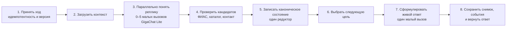

# Архитектура Б: минимальный устойчивый диалог

## Прямой вывод

Для текущего бизнес-процесса не нужен граф из 36 исполняемых узлов, 58 связей,
37 верхнеуровневых полей и 127 полей во вложенных структурах. Он распределяет
одно решение между слишком многими владельцами. Предлагаемый цикл — восемь
исполняемых шагов, семь постоянных переходов и десять канонических полей
рабочего состояния.

Числа 8/7/10 не являются запретом на девятый шаг или одиннадцатое поле. Это
минимум, полученный из реального пути заявки. Расширение допустимо после
сценария, который невозможно корректно выразить существующим владельцем.

## Поток одного хода

Внутри шага 3 нет отдельных веток графа. Нужные извлечения запускаются
одновременно:

1. объект/адрес;
2. услуга и описание проблемы;
3. имя и контакт;
4. подтверждение, исправление или отмена;
5. разговорная реплика, которая не несёт нового факта, но требует вернуть
   человека к заявке.

Обычно нужны 1–3 вызова, а не все пять. После них код проверяет кандидаты по
внешним источникам. Если модель вернула неразбираемую структуру, разрешён один
малый повтор с исходным ответом и требуемой схемой. Поэтому нормальный путь
имеет две последовательные стадии модели, а аварийный — три.

## Каноническое рабочее состояние

| № | Поле | Кто пишет | Зачем хранить |
|---:|---|---|---|
| 1 | `object_id` | редуктор после ФИАС/каталога объектов | подтверждённый объект обслуживания |
| 2 | `service_id` | редуктор после каталога | выбранная услуга |
| 3 | `contact_name` | редуктор после проверки кандидата | имя заявителя |
| 4 | `contact_phone` | редуктор после проверки формата/канала | обратная связь |
| 5 | `problem_text` | редуктор | понятное описание неисправности |
| 6 | `dialog_status` | планировщик через редуктор | сбор, подтверждение, завершение, отмена |
| 7 | `last_goal` | планировщик через редуктор | что бот должен получить следующей репликой |
| 8 | `summary_version` | редуктор | версия показанного пользователю резюме |
| 9 | `confirmed_version` | редуктор | какую именно версию подтвердил пользователь |
| 10 | `work_order_id` | сервис документов | созданная заявка или пустое значение |

`session_id`, `message_id`, номер хода и версия доставки лежат в оболочке
запроса/таблице хода, а не дублируются в бизнес-состоянии. Недостающие поля,
текст следующего вопроса и готовность заявки вычисляются. Кандидаты модели и
ФИАС живут только в журнале текущего хода, пока редуктор их не принял.

## Цели вместо ветвящегося сценария

Планировщик выбирает одно значение `last_goal`: запросить недостающее поле,
уточнить неоднозначность, показать резюме, применить исправление, создать
заявку, вернуть разговор к заявке или завершить диалог. Это данные для шага 7,
а не новые узлы и переходы. Генератор видит проверенные факты, цель и последний
диалог, поэтому отвечает живо, но не придумывает бизнес-факты.

## Контрольные снимки и отладка

Контрольные снимки нужны. Ошибкой А является не их наличие, а полный снимок
после множества внутренних узлов.

- снимок `before_turn` — что система знала до реплики;
- снимок `after_turn` — что принял редуктор;
- снимок `order_created` — точное состояние, из которого создан документ;
- события шага — входные ссылки, длительность, решение и разница полей;
- отдельные журналы — запросы модели и внешних систем без секретов.

Экран отладки восстанавливает движение данных из снимков и событий. Это даёт
вид n8n без размножения таблиц состояния и без записи 36 полных копий на ход.

