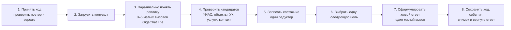

# Архитектура Б: минимальный устойчивый диалог

## Вывод

Для текущего процесса достаточно восьми исполняемых шагов и семи постоянных
переходов. Не требуется отдельный узел для каждого вопроса, поля или результата
модели. После проверки сценария «адреса нет в нашей БД, но пользователь называет
известную УК» рабочее состояние расширено с 10 до 13 полей: это необходимая
информация, а не стремление уложиться в красивую цифру.

## Один ход: 8 шагов, 7 переходов

Шаг 3 запускает только реально нужные независимые задачи: адрес/УК,
услуга/проблема, контакт, подтверждение/исправление, отношение реплики к цели.
Одновременно разрешено до пяти вызовов. Обычно выполняется 1–3. Затем следует
одна последовательная генерация ответа. Только неразбираемый ответ модели
разрешает один короткий повтор с исходным ответом и требуемой схемой. Поэтому
нормальный путь содержит не больше двух последовательных стадий модели,
аварийный — не больше трёх.

## Рабочее состояние: 13 канонических полей

| № | Поле | Смысл и владелец записи |
|---:|---|---|
| 1 | `raw_address` | исходный адрес пользователя; пишет редуктор |
| 2 | `service_object_id` | подтверждённый объект или пусто; пишет редуктор после каталога/ФИАС |
| 3 | `organization_id` | подтверждённая или названная пользователем УК из нашего справочника |
| 4 | `address_resolution` | `object_confirmed`, `known_organization_claimed` или `unresolved` |
| 5 | `service_id` | услуга, подтверждённая каталогом |
| 6 | `contact_name` | имя заявителя |
| 7 | `contact_phone` | проверенный контакт |
| 8 | `problem_text` | принятое описание проблемы |
| 9 | `dialog_status` | сбор, подтверждение, завершение или отмена |
| 10 | `last_goal` | единственная цель следующей реплики бота |
| 11 | `summary_version` | версия резюме, показанного пользователю |
| 12 | `confirmed_version` | версия, которую действительно подтвердили |
| 13 | `request_id` | созданное «Обращение» или пусто |

`session_id`, `message_id`, номер хода и версия доставки принадлежат оболочке
хода, а не бизнес-состоянию. Недостающие поля, готовность документа и текст
вопроса вычисляются. Кандидаты GigaChat и ФИАС живут в журнале хода, пока
редуктор их не примет.

## Адреса нет, но пользователь называет известную УК

Это штатный сценарий, а не ошибка и не новая длинная ветка графа.

1. Проверяющий шага 4 ищет полный адрес в локальных `service_objects` и ФИАС.
2. Если объект не найден, проверяющий сопоставляет названную УК только со
   справочником `organizations`; при нескольких вариантах планировщик просит
   выбрать конкретный.
3. Редуктор сохраняет `raw_address`, пустой `service_object_id`, найденный
   `organization_id` и `address_resolution=known_organization_claimed`.
4. После сбора остальных полей планировщик показывает резюме с явной пометкой,
   что объект требует проверки.
5. Подтверждение создаёт `requests` с известной УК и исходным адресом; документ
   попадает в рабочий список «Объект не подтверждён».
6. Оператор связывает документ с существующим объектом либо создаёт объект
   отдельным разрешённым действием. `request_history` фиксирует решение.

Если названной УК нет в справочнике, система сохраняет её только как кандидат
в журнале хода и уточняет данные; она не создаёт выдуманную компанию.

## Цели вместо разрастания графа

`last_goal` принимает одну цель: получить недостающее поле, уточнить
неоднозначность, показать резюме, применить исправление, создать обращение,
вернуть разговор к обращению или завершить диалог. Генератор ответа получает
проверенные факты, цель и короткое окно последних реплик. Он выбирает живую
формулировку, но не меняет факты и не создаёт документ.

## Снимки и отладка

Контрольные снимки нужны, но только в точках, где бизнес-состояние имеет смысл:

- `before_turn` — знания до реплики;
- `after_turn` — результат единственного редуктора;
- `request_created` — точное состояние, из которого создан документ.

`dialog_trace_events` хранит восемь выполненных шагов, длительность, ссылки на
входы/выходы, решение и разницу полей. `llm_calls` и `integration_calls` хранят
очищенные внешние вызовы. Экран в стиле n8n строится по этим записям и показывает
движение данных без 36 полных снимков на один ход.

## Критерий изменения минимума

Новый шаг допустим, только если появляется отдельное действие с собственным
входом, выходом и отказом, которое нельзя выполнить внутри одного из восьми
владельцев. Новое поле допустимо, только если его нельзя вычислить и оно нужно
после завершения текущего шага или для восстановления сессии.
