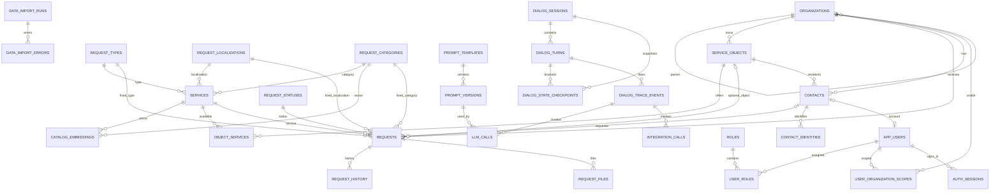

# База данных Kom_Dom_B

## Фактическое и проектное состояние

На production создана отдельная PostgreSQL-БД `komunal_dom_b`. До миграции
`0001` в ней было 0 публичных таблиц. Первая отдельная миграция переносит
только справочник `request_types` — «ТипОбращения» — из read-only выборки
`ref_service_types` Коммуналки А. Остальная схема ниже остаётся проектом.

`pgvector` устанавливает администратор PostgreSQL один раз командой
`CREATE EXTENSION vector`. Прикладной пользователь `komunal_b_app` не получает
права суперпользователя; поэтому установка расширения намеренно отсутствует в
`schema_v0.sql`.

После `0001` таблица содержит канонические записи `(1, incident, «Инцидент»)` и
`(2, request, «Запрос»)`. Единственный писатель справочника на этом этапе —
SQL-миграция из `db/migrations`; следующий компонент читает `request_types` по
ID при переносе услуг и создании обращения.

Число 31 возникло из реальных сущностей, а не из желания заполнить лимит.
Документ один — `requests`. Тип обращения и локализация возвращены в отдельные
справочники, потому что это самостоятельные значения, на которые ссылаются
услуги и обращения. Вектор хранится отдельно от редактируемого текста, чтобы
смена модели не меняла бизнес-таблицы.

## Группы таблиц

### Справочники, каталог и настройки — 13

1. `organizations` — УК и другие компании.
2. `service_objects` — дома, помещения и иные обслуживаемые объекты.
3. `request_types` — «Инцидент» (1) и «Запрос» (2).
4. `request_localizations` — общедомовое/индивидуальное место проблемы.
5. `request_categories` — категории обращений и текст для смыслового поиска.
6. `services` — точная услуга с типом, локализацией и категорией.
7. `catalog_embeddings` — числовые представления текстов категорий и услуг.
8. `object_services` — какие услуги доступны на конкретном объекте.
9. `contacts` — жители, сотрудники и иные контактные лица.
10. `contact_identities` — Telegram, MAX, телефон и другие идентификаторы.
11. `app_settings` — константы продукта, кроме секретов среды.
12. `prompt_templates` — назначение этапного промпта и активная версия.
13. `prompt_versions` — неизменяемые версии промпта, JSON-схемы и модели.

### Документ и подчинённые данные — 4

14. `request_statuses` — справочник статусов.
15. `requests` — единственный документ «Обращение».
16. `request_history` — история действий и изменения статуса.
17. `request_files` — приложенные к обращению файлы.

### Учётные записи и права — 5

18. `app_users` — учётные записи портала.
19. `roles` — роли и разрешённые действия.
20. `user_roles` — несколько ролей пользователя.
21. `user_organization_scopes` — доступ пользователя к компаниям.
22. `auth_sessions` — серверные сессии входа.

### Диалоги и отладка — 6

23. `dialog_sessions` — одна беседа и версия её состояния.
24. `dialog_turns` — входящая реплика, ответ и итог одного хода.
25. `dialog_state_checkpoints` — снимки до/после хода и при создании документа.
26. `dialog_trace_events` — движение данных по исполняемым шагам.
27. `llm_calls` — очищенные вызовы GigaChat, JSON и задержка.
28. `integration_calls` — вызовы ФИАС, Telegram и других систем.

### Администрирование и перенос — 3

29. `admin_audit_log` — кто и что изменил в интерфейсе.
30. `data_import_runs` — один запуск проверяемого импорта.
31. `data_import_errors` — непринятые строки и причина.

## Полная структура «Категории обращений»

Таблица `request_categories`:

| Поле | Тип | Обязательное | Назначение |
|---|---|---:|---|
| `id` | `smallint` | да | Стабильный идентификатор, переносимый из А |
| `external_key` | `text`, уникальное | нет | Ключ внешней системы, если ID источников позже разойдутся |
| `name` | `text` | да | Короткое название для интерфейса |
| `ai_description` | `text` | да | Полное описание смысла категории для поиска и GigaChat |
| `synonyms` | `text[]` | да | Термины жителей: «труба», «стояк», «батарея» |
| `exclusion_hints` | `text[]` | да | Похожие случаи, которые относятся к другой категории |
| `operator_notes` | `text` | нет | Пояснение оператору; в запрос модели по умолчанию не идёт |
| `sort_order` | `smallint` | да | Порядок в форме списка |
| `catalog_revision` | `bigint` | да | Версия записи для обновления вектора и Redis |
| `is_active` | `boolean` | да | Доступность для нового обращения |
| `created_at` | `timestamptz` | да | Создание строки |
| `updated_at` | `timestamptz` | да | Последнее изменение |

Категория по умолчанию удалена. Если поиск не уверен, агент задаёт короткое
уточнение; молчаливое присвоение «прочего» ухудшило бы качество данных.

## Полная структура «Услуги»

Таблица `services`:

| Поле | Тип | Обязательное | Назначение |
|---|---|---:|---|
| `id` | `integer` | да | Стабильный идентификатор услуги из А |
| `category_id` | FK → `request_categories` | да | Категория обращения |
| `request_type_id` | FK → `request_types` | да | Инцидент или запрос |
| `localization_id` | FK → `request_localizations` | да | Общедомовое или индивидуальное |
| `external_key` | `text`, уникальное | нет | Ключ внешней системы |
| `name` | `text` | да | Название для интерфейса и документа |
| `description` | `text` | да | Бизнес-описание услуги |
| `ai_description` | `text` | да | Как распознать услугу по словам пользователя |
| `synonyms` | `text[]` | да | Частые бытовые названия |
| `exclusion_hints` | `text[]` | да | Похожие, но неверные случаи |
| `route_code` | `text` | нет | Код будущего маршрута исполнителю |
| `is_internal` | `boolean` | да | Служебная услуга, скрытая от обычного выбора |
| `catalog_revision` | `bigint` | да | Версия для вектора и быстрого снимка |
| `is_active` | `boolean` | да | Можно ли выбрать услугу сейчас |
| `created_at` | `timestamptz` | да | Создание строки |
| `updated_at` | `timestamptz` | да | Последнее изменение |

## Полная структура векторов

Таблица `catalog_embeddings`:

| Поле | Тип | Назначение |
|---|---|---|
| `id` | `bigint identity` | Технический ключ |
| `category_id` | FK, допускает пусто | Вектор категории |
| `service_id` | FK, допускает пусто | Вектор услуги |
| `model` | `text` | Точная модель GigaChat Embeddings |
| `dimensions` | `smallint` | Фактическое число координат |
| `source_text` | `text` | Текст, из которого построен вектор |
| `source_hash` | `char(64)` | Контрольная сумма текста |
| `embedding` | `vector` | Массив чисел `pgvector`; размер не зашит до выбора модели |
| `status` | `pending/ready/error` | Готовность записи к поиску |
| `error_code` | `text` | Причина неудачной перестройки |
| `catalog_revision` | `bigint` | Версия исходной категории/услуги |
| `created_at`, `updated_at` | `timestamptz` | Служебное время |

Одна строка относится ровно к категории или услуге. Отдельные уникальные
индексы не дают создать два вектора одной модели для одной сущности. В поиск
попадают только строки `status=ready`, у которых версия совпадает с каталогом.

## Схема связей как в Microsoft Access

## Адрес без объекта

`requests.object_id` допускает пустое значение. Документ при этом хранит
исходный адрес, известную УК и `address_resolution_status`. Так утверждение
«моя УК есть у вас» приводит к обращению в очереди проверки объекта, а не к
потере разговора.
