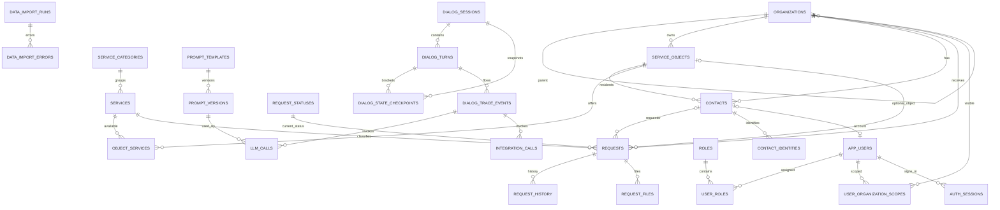

# База данных Kom_Dom_B

## Фактическое состояние

На сервере создана отдельная PostgreSQL-БД `komunal_dom_b` с владельцем
`komunal_b_app`. В ней 0 прикладных таблиц: `schema_v0.sql` пока является
проектом и будет применён только после согласования. Коммуналка Б не читает и
не изменяет БД А.

## Почему 28 таблиц — это не 28 бизнес-документов

Бизнес-документ ровно один: `requests` — «Обращения». Остальные таблицы —
справочники, подчинённые строки документа, права, сессии и диагностические
журналы. Склеивание их в универсальный JSON сократило бы список таблиц, но
вернуло бы неясные контракты и ручную проверку связей.

### Справочники и настройки — 10

1. `organizations` — УК/компании и их иерархия.
2. `service_objects` — обслуживаемые дома, помещения и другие объекты.
3. `service_categories` — 11 категорий и описание категории для ИИ.
4. `services` — услуги, категория, тип, локализация и описания.
5. `object_services` — доступность услуги на объекте.
6. `contacts` — жители, сотрудники и другие контактные лица.
7. `contact_identities` — MAX, Telegram, телефон и другие идентификаторы.
8. `app_settings` — константы продукта, но не секреты среды.
9. `prompt_templates` — назначение шаблона модели и активная версия.
10. `prompt_versions` — неизменяемая история текста, схемы и настроек.

Тип услуги и локализация остаются небольшими кодовыми полями `services`, а не
двумя отдельными таблицами: сейчас у них нет собственной сложной формы,
жизненного цикла или связей.

### Документ и подчинённые данные — 4

11. `request_statuses` — справочник статусов; это не документ.
12. `requests` — единственный документ «Обращение».
13. `request_history` — служебная история: кто, когда и почему изменил статус
    или привязал подтверждённый объект; это не второй документ.
14. `request_files` — подчинённые файлы одного обращения.

Старая предложенная `work_order_links` означала бы связи «дубликат»,
«продолжение» или «родитель–потомок». Для текущего процесса такой сценарий не
доказан, поэтому таблица удалена из v0. Если связь обращений действительно
понадобится, сначала описывается действие пользователя и только затем
добавляется `request_relations`.

### Учётные записи и права — 5

15. `app_users` — учётные записи операторов/администраторов.
16. `roles` — роли и разрешённые действия.
17. `user_roles` — несколько ролей у одного пользователя.
18. `user_organization_scopes` — компании, данные которых видит пользователь.
19. `auth_sessions` — серверные сессии интерфейса.

### Диалоги и отладка — 6

20. `dialog_sessions` — границы и версия состояния диалога.
21. `dialog_turns` — реплика, ответ и время одного хода.
22. `dialog_state_checkpoints` — снимки до/после хода и при создании обращения.
23. `dialog_trace_events` — движение данных по восьми шагам.
24. `llm_calls` — вызовы GigaChat Lite, разобранный результат и время.
25. `integration_calls` — ФИАС/ГАР, Asterisk, MAX и другие внешние вызовы.

### Администрирование и перенос — 3

26. `admin_audit_log` — кто изменил бизнес-данные через интерфейс.
27. `data_import_runs` — один проверяемый запуск импорта из А.
28. `data_import_errors` — непринятые строки и причина.

## Адрес без объекта

`requests.object_id` допускает пустое значение, но документ всегда сохраняет
`raw_address_text`, `organization_id` и `address_resolution_status`. Поэтому
утверждение пользователя «мою УК вы знаете» не теряется: известная УК
фиксируется, исходный адрес остаётся, а обращение видно в очереди ручной
проверки. Привязку объекта фиксирует `request_history`.

## Схема связей как в Microsoft Access

## Векторное расширение не входит в ядро v0

Отдельная `catalog_embeddings` будет добавлена только после измерения качества
и задержки. При 55 исходных текстах не нужен приближённый индекс: точный поиск
PostgreSQL с `pgvector` проще и воспроизводимее. Redis без модуля поиска векторов
не заменяет такую таблицу; его роль — быстрый снимок справочника и уведомление
рабочих процессов о новой версии. Подробное решение находится в
`CATALOG_SEARCH_DECISION.md`.
