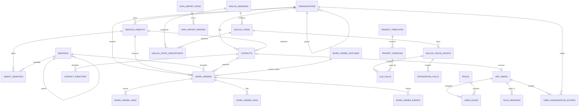

# База данных Коммуналки Б

## Почему не «максимум 10»

Жёсткий предел 10 или 11 таблиц не имеет технического смысла. В продукте есть
разные сущности: справочник объектов, документ заявки, роли пользователей,
снимки диалога и вызовы внешних систем. У них разные связи и сроки хранения.
Склейка ради меньшего числа таблиц создаст универсальные JSON-поля и вернёт ту
же неясность, от которой мы уходим.

Проект v0 содержит 28 прикладных таблиц. PostgreSQL может иметь собственные
системные таблицы, но они не относятся к приложению.

## Таблицы и назначение

### Справочники и настройки — 9

1. `organizations` — компании/УК и их иерархия.
2. `service_objects` — дома, помещения и другие объекты обслуживания.
3. `services` — дерево услуг.
4. `object_services` — какие услуги доступны на конкретном объекте и когда.
5. `contacts` — жители, сотрудники и другие контактные лица.
6. `contact_identities` — связь контакта с MAX, Telegram, телефоном и другими
   идентификаторами канала.
7. `app_settings` — константы продукта, не секреты среды.
8. `prompt_templates` — назначение шаблона запроса к модели и активная версия.
9. `prompt_versions` — неизменяемая история текста, схемы ответа и настроек.

### Документы — 5

10. `work_order_statuses` — допустимые состояния заявки.
11. `work_orders` — шапка и текущие поля документа «Заявка».
12. `work_order_events` — история действий и смен состояний документа.
13. `work_order_files` — вложения заявки.
14. `work_order_links` — связи заявок между собой.

### Учётные записи и права — 5

15. `app_users` — учётные записи операторов/администраторов.
16. `roles` — роли и наборы действий.
17. `user_roles` — несколько ролей у одного пользователя.
18. `user_organization_scopes` — компании, данные которых видит пользователь.
19. `auth_sessions` — серверные сессии интерфейса; браузер хранит только
    случайный ключ, в БД — его хэш и срок жизни.

### Диалоги и отладка — 6

20. `dialog_sessions` — границы и текущее состояние диалога.
21. `dialog_turns` — реплика пользователя, ответ бота и время одного хода.
22. `dialog_state_checkpoints` — компактные снимки до/после хода и при создании
    заявки.
23. `dialog_trace_events` — движение данных по восьми шагам и разница
    состояния.
24. `llm_calls` — запросы GigaChat Lite, структурированный результат, время и
    ошибка.
25. `integration_calls` — ФИАС/ГАР, MAX, Telegram, Asterisk и другие внешние
    вызовы.

### Администрирование и перенос — 3

26. `admin_audit_log` — кто и что изменил через интерфейс.
27. `data_import_runs` — один запуск переноса данных из А.
28. `data_import_errors` — непринятые строки и причина, без скрытого пропуска.

## Схема связей как в Microsoft Access

Полный проект полей и индексов находится в `db/design/schema_v0.sql`. Он ещё
не применён: отдельная production-БД остаётся пустой до согласования.

