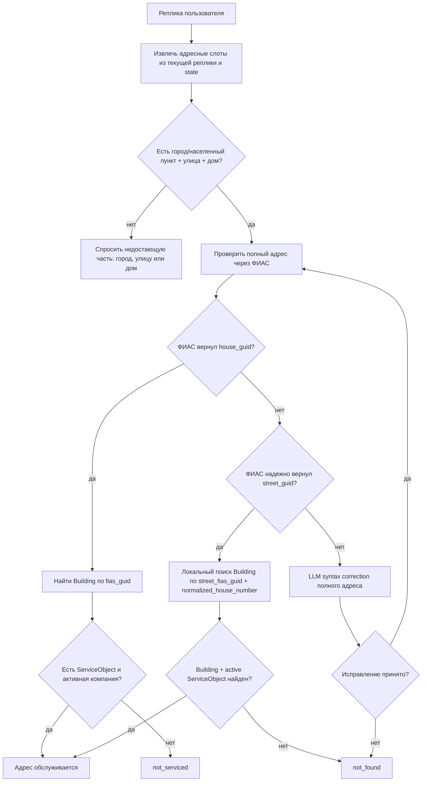

# ТЗ: адресная логика и оптимизация скорости

Статус: активное ТЗ для ближайшей реализации. Единый оркестратор фраз в эту задачу не входит.

## Цель

Собрать полный адрес из реплик пользователя, проверить его существование через ФИАС/ГАР, принять допустимые локальные исключения и определить, обслуживается ли адрес одной из компаний.

Одновременно снизить задержку за счет уменьшения лишних LLM-вызовов и повторов из-за невалидного JSON.

## Корневая Ошибка

В диалоге `347e498e-5f23-4a7c-a343-5ea28902cf2d_stt` пользователь сказал `Абрикосовая 2`.

Фактическая цепочка:

- `AddressAgent.slots` вернул `street=Абрикосовая`, `house_number=2`, `city=null`;
- адрес был неполный, но `_should_try_syntax_correction()` разрешил LLM-коррекцию;
- `_local_candidate_hints()` нашел обслуживаемый дом только по номеру дома: `Сочи, Мацестинская, 2`;
- prompt `AddressAgent.syntax_correction` передал это как реальный кандидат;
- LLM добавила `Сочи`, сохранив `Абрикосовая`;
- ФИАС нашел реальный адрес `Сочи, Абрикосовая, 2`, но он не обслуживается.

Это системная ошибка алгоритма: локальный кандидат был получен по одному номеру дома без уже найденного ФИАС ID улицы.

## Целевая Блок-Схема



## Правила Полноты

Обязательные части адреса:

- населенный пункт;
- улица;
- дом.

Если отсутствует одна или несколько обязательных частей:

- не вызывать ФИАС;
- не вызывать LLM-коррекцию;
- не вызывать `local_candidate_hints()`;
- спросить только недостающую часть.

Примеры:

- `Абрикосовая 2` -> спросить населенный пункт;
- `Сочи 2` -> спросить улицу;
- `Сочи Абрикосовая` -> спросить номер дома.

## ФИАС-Валидация

ФИАС является первым источником проверки существования полного адреса.

Сценарии:

1. ФИАС вернул `fias_house_guid`: искать локальный `Building` по `fias_guid`.
2. ФИАС не вернул `fias_house_guid`, но надежно вернул `fias_street_guid`: искать локальный дом по `street_fias_guid + normalized_house_number`.
3. ФИАС не нашел улицу или не понял полный адрес: запускать LLM-коррекцию адреса, затем повторить ФИАС.

## Локальное Исключение Для Дома Без ФИАС

Это единственный случай, когда локальный адрес может быть принят без `fias_house_guid`:

- полный адрес введен;
- ФИАС нашел улицу и вернул `fias_street_guid`;
- ФИАС не нашел точный дом;
- в локальной базе есть `Building` с тем же `street_fias_guid` и `normalized_house_number`;
- у этого `Building` есть активный `ServiceObject`;
- по `ServiceObject` находится активная компания через период обслуживания.

Любой поиск по одному номеру дома запрещен.

## LLM-Коррекция Адреса

Синтаксическая ошибка может быть в городе, улице или доме. Но LLM-коррекция запускается только после проверки полноты.

Допустимые случаи:

- `Обррикосовая 20` при полном адресе с городом;
- `Ростов на дону, Масковская, 10`;
- `Сочи, Абрикосовая, 27бэ`;
- STT склеило или исказило часть полного адреса.

Недопустимые случаи:

- `Абрикосовая 2` без города;
- `2` без улицы и города;
- `Сочи 2` без улицы.

Prompt `address-syntax-correction-runtime`:

```text
Ты исправляешь полный адрес после неудачной проверки ФИАС.

Адрес: {full_address}
Причина ФИАС: {fias_reason}
Кандидаты ФИАС по этому адресу: {fias_candidate_hints}

Правила:
- работай только с полным адресом: населенный пункт, улица, дом;
- если адрес неполный, верни action="ask_missing";
- исправляй только очевидную ошибку в городе, улице или доме;
- не добавляй город, если его не было в репликах и его не нашел ФИАС;
- не выбирай обслуживаемый адрес по одному номеру дома;
- если ФИАС нашел улицу, не меняй ее на другую;
- если уверенности нет, верни action="no_change".

Верни JSON:
{"action":"correct|ask_missing|no_change","city":null,"street":null,"house_number":null,"confidence":0.0,"reason":""}
```

## Мини-Тесты На Сложные Названия

Перед внедрением проверить LLM отдельно на кейсах:

1. `Ростов на Дону, улица Ростовская, дом 5`
2. `город Ростов, улица Московская, дом 10`
3. `Московский, улица Московская, дом 3`
4. `Ростов на дону московская 10`
5. `город Сочи, улица Обррикосовая, дом 20`
6. `Сочи, Абрикосовая, 27бэ`

Ожидание: LLM не должна дробить `Ростов на Дону` в город `Ростов` и улицу `Надону`; не должна превращать `Московский` в город `Москва`; должна исправлять только очевидные ошибки.

## Оптимизация Скорости

Текущий плохой пример: на `Абрикосовая 2` было 9 LLM-вызовов и `6284.9 ms`.

Цель:

- неполный адрес: 1 LLM-вызов максимум или 0, если слоты уже есть;
- невалидный JSON retry: стремиться к 0;
- не запускать ФИАС и syntax correction для неполного адреса;
- убрать повторный `AddressAgent.slots`, если `TurnSplitterAgent` уже вернул адресные слоты с evidence;
- использовать structured output GigaChat, если текущий API поддерживает `response_format`/JSON Schema или function calling.

## Параллельные LLM-Вызовы

В рамках этого ТЗ допустимо:

- параллелить `DialogGuardAgent.check` и `TurnSplitterAgent.analyze`, если статический guard не заблокировал реплику;
- после готового `txtPrb` параллелить независимые фильтры услуги: тип обращения, локализацию и категорию;
- ограничить параллельность через semaphore: стартово `GIGACHAT_MAX_PARALLEL_REQUESTS=6`.

Недопустимо:

- параллелить address syntax correction до проверки полноты;
- запускать локальный поиск-кандидаты до ФИАС-улицы;
- делать параллельные retry, если причина retry - невалидный prompt/schema.

## Логирование Производительности

Добавить в trace/performance:

- `pipeline_version`;
- `address_resolution_mode`;
- `missing_address_fields`;
- `fias_house_guid_found`;
- `fias_street_guid_found`;
- `local_lookup_mode`;
- `llm_call_count`;
- `llm_retry_count`;
- `invalid_json_count`;
- `prompt_slug`;
- `prompt_chars`;
- `response_chars`;
- `tokens`;
- `duration_ms`;
- `parallel_group_id`;
- `correction_action`;
- `correction_accepted`.

Сравнивать до/после:

- p50/p95 API latency;
- LLM-вызовов на один user turn;
- retry на один user turn;
- стоимость токенов;
- долю ошибочных `not_serviced`;
- долю неполных адресов, где бот задал правильный недостающий вопрос.

## Критерии Готовности

- `Абрикосовая 2` без города не подставляет `Сочи`, а спрашивает населенный пункт.
- `Сочи, Обррикосовая 20` проходит LLM-коррекцию и повторный ФИАС.
- Дом без `fias_house_guid`, но с найденной ФИАС-улицей, принимается только при совпадении `street_fias_guid + normalized_house_number`.
- Локальный поиск по одному номеру дома отсутствует.
- Невалидный JSON от GigaChat не вызывает каскад из 3-4 retry.
- В trace видно, почему выбран каждый адресный путь.

## Реализация 2026-05-18

- Перед стартом работ сделан снимок ветки `feature/tz-26-12-critical-fixes`: commit `b9e5d49`.
- `AddressExtractor.validate_and_match_to_db()` больше не ищет локальный дом по `city+street+house` до ФИАС; сначала всегда вызывается `resolve_building_with_fallback()`.
- Локальное принятие дома без `fias_house_guid` осталось только через `_find_local_building(fias_guid, street_guid, house_number)`, то есть по `street_fias_guid + normalized_house_number`.
- `AddressAgent._should_try_syntax_correction()` теперь запускает LLM-коррекцию только при `match_status=not_found` и полном наборе `city+street+house`; статус `incomplete` больше не идет ни в ФИАС, ни в синтаксическую LLM-коррекцию.
- Удалено автоматическое принятие единственного локального кандидата из syntax correction; это было источником смешивания `Сочи` из одного адреса с `Абрикосовая` из реплики.
- `AddressAgent.syntax_correction` теперь передает в LLM исходную строку адреса, предыдущий разбор и `fias_candidate_hints`; локальные подсказки разрешены только если ФИАС уже вернул `street_fias_guid`.
- `address-slots-lite` обновлен в БД: активная версия `id=239`. Добавлен общий контракт для многословных населенных пунктов и разделения `city/street` без частных адресных примеров.
- `DialogGuardAgent.check` и `TurnSplitterAgent.analyze` запускаются параллельно, если статический guard не заблокировал реплику.
- `LiteLLMClient` получил лимит параллельности `GIGACHAT_MAX_PARALLEL_REQUESTS` со значением по умолчанию `6`.
- `AIAgentService` получил общий кэш OAuth-токена GigaChat и async lock, чтобы параллельные LLM-вызовы не создавали пачку запросов `/oauth`.

Проверки:

- `venv/bin/python manage.py check` -> `System check identified no issues`.
- `Абрикосовая 2` -> `incomplete`, вопрос `Уточните населенный пункт.`, `fias_log_count=0`, syntax correction не запускалась.
- `Абрикосовая 2 нет света` -> `incomplete`, город не подставлен, `fias_log_count=0`.
- `город Сочи, улица Обррикосовая, дом 20` -> syntax correction через ФИАС-подсказки исправила улицу на `Абрикосовая`, повторная проверка дала `matched`.
- `Сочи` при известных `street=Абрикосовая`, `house=20` -> `matched`.
- Параллельный тест 8 коротких LLM-вызовов после OAuth-кэша: все 8 успешно, total `677 ms`, 429 не было.

Оставшийся риск:

- GigaChat Lite в `address-slots-lite` нестабилен на голой строке `Ростов на дону московская 10`: иногда режет `city` до `Ростов`. Второй слой `AddressAgent.syntax_correction` с исходной строкой и ФИАС-подсказками исправляет это в проверенном кейсе, но для максимальной надежности нужен structured output/JSON Schema и, вероятно, отдельный канонизатор адресных слотов.

## Дополнительная Проверка 2026-05-18 После Вопроса По Скорости

Полный прогон через `MessageHandlerService.handle_incoming_message`:

- session `test_bot_codex_speed_full_1ba3cca2_20260518_092255`;
- turn 1 `Привет`: `44.7 ms`, `0` LLM;
- turn 2 `Абрикосовая 2 нет света`: `5959.0 ms`, `11` LLM, `0` ФИАС, ответ `Приняла: нет света. Теперь нужно уточнить город.`;
- turn 3 `Сочи`: `2864.8 ms`, `6` LLM, `1` ФИАС, ответ `Сочи, Абрикосовая 2 - нами не обслуживается.`;
- адресная логика работает правильно: неполный адрес не идет в ФИАС и не подставляет город;
- оптимизация скорости неполная: задержку теперь создает не ФИАС, а невалидный JSON от GigaChat Lite и каскад retry.

Разбор `llm_request_log` по этому session:

- `DialogGuardAgent.check`: первичный ответ `{action:continue,...}` без кавычек -> `retry_json_contract`;
- `TurnSplitterAgent.analyze`: первичный ответ с ключами без кавычек -> `retry_json_contract`;
- `AddressAgent.slots`: первичный ответ с ключами без кавычек -> `retry_json_contract`;
- `AddressAgent.slots.retry_contract`: повторил тот же невалидный формат -> еще один `retry_json_contract`;
- `ProblemAgent.fragment`: JSON в Markdown-блоке, текущий parser это принимает, но `ProblemAgent.fragment.retry_contract` сработал из-за уточнения содержимого `clean_fragment`;
- `BotOrderOrchestrator.followup_ack`: text-call, не должен быть JSON.

Вывод: текущая стабилизация JSON работает как восстановление после ошибки, но не предотвращает ошибку. Следующий шаг ТЗ по скорости - заменить prompt-only контракт для `DialogGuardAgent`, `TurnSplitterAgent`, `AddressAgent.slots` на более жесткий режим: либо официальный structured output/function calling, если доступно в текущем GigaChat REST/SDK, либо локальный repair-parser для простых JSON-like ответов без повторного LLM-вызова.

## Проверка GigaChat JSON/Function Calling 2026-05-18

Временный диагностический скрипт: `runtime/gigachat_json_capability_probe.py`.
Результат на сервере: `/var/www/komunal-dom_ru/runtime/gigachat_json_capability_probe_result_20260518_100953.json`.

Окружение проверки:

- профиль GigaChat: `alt`;
- scope: `GIGACHAT_API_B2B`;
- модель: `GigaChat-2`;
- установленный SDK `gigachat`: `0.1.43`;
- в SDK `0.1.43` нет методов `chat_parse()` / `achat_parse()`, поэтому structured output через SDK в текущем окружении недоступен.

Факты по прямому REST `/api/v1/chat/completions`:

- prompt-only платежный JSON: `6/6` HTTP 200, `6/6` распарсились текущим parser, `6/6` прошли Pydantic; часть ответов была в Markdown-блоке, но текущий parser это умеет чистить.
- реальный `address-slots-lite` на `Абрикосовая 2 нет света`: `6/6` HTTP 200, но `0/6` валидный JSON; модель стабильно вернула JSON-like объект с ключами без кавычек.
- `response_format={"type":"json_object"}`: HTTP 200, но модель вернула поясняющий текст и значения enum вне схемы; Pydantic не прошел.
- `response_format` с JSON Schema в OpenAI-совместимом и плоском вариантах: HTTP 400 `Empty schema with json format type is not supported`.
- `functions + function_call` с сырой Pydantic-схемой и `date: Optional[str]`: HTTP 422 `Type properties.date.type is wrong`.
- `functions + function_call` с компактной схемой, но `date` через `anyOf string/null`: HTTP 422 `Type properties.date.type is wrong`.
- `functions + function_call` со схемой без `null`/`anyOf`, где неизвестная дата передается пустой строкой: `2/2` HTTP 200, `finish_reason=function_call`, аргументы пришли как объект в `message.function_call.arguments`, `2/2` прошли Pydantic.
- OpenAI tools-style (`tools/tool_choice`) не сработал как tool call: HTTP 200, `finish_reason=stop`, обычный текст.

Вывод:

- текущий GigaChat Lite/`GigaChat-2` в нашем REST-режиме не дает надежного native JSON Schema через `response_format`;
- официальный `function_call` работает и решает проблему "ключи без кавычек", но схема должна быть совместимой с ограничениями GigaChat: без `null`/`anyOf` в `type`; nullable-поля нужно кодировать через строку с пустым значением или отдельный boolean/status;
- для `DialogGuardAgent`, `TurnSplitterAgent`, `AddressAgent.slots` перспективный путь - перейти на `functions + function_call` с упрощенными схемами, а не пытаться лечить prompt-only JSON повторными LLM retry;
- для уже существующих prompt-only ответов можно отдельно рассмотреть локальный JSON-like repair-parser для ключей без кавычек, но это должен быть общий слой стабилизации контракта, а не частные regex по адресам.

Дополнительная проверка стабильности фиктивной функции без `null/anyOf`:

- временный скрипт: `runtime/gigachat_function_call_stability_probe.py`;
- результат 30 последовательных + 12 параллельных вызовов: `/var/www/komunal-dom_ru/runtime/gigachat_function_call_stability_result_20260518_103518.json`;
- результат 50 последовательных вызовов: `/var/www/komunal-dom_ru/runtime/gigachat_function_call_stability_result_20260518_103550.json`;
- 50 последовательных вызовов: `50/50` HTTP 200, `50/50` `finish_reason=function_call`, `50/50` аргументы функции получены, `50/50` прошли Pydantic;
- 30 последовательных + 12 параллельных: `40/42` HTTP 200 и `40/40` успешных ответов прошли Pydantic; 2 вызова вернули `429 Too Many Requests`, это лимит частоты/параллельности, не JSON-ошибка;
- семантическая категория платежа не является гарантией схемы: для `Заплатить за домофон без точной даты` модель стабильно выбрала `utilities`, а тест ожидал `other`. Это значит, что function calling решает формат/валидность JSON, но смысловые enum-границы все равно нужно описывать в схеме и проверять бизнес-логикой.

Проверка версии SDK:

- на сервере установлен `gigachat==0.1.43`;
- `pip index versions gigachat` показал актуальную версию `0.2.1`;
- PyPI указывает `gigachat 0.2.1`, release date `Apr 27, 2026`;
- вывод про отсутствие `chat_parse()` относится к установленному SDK `0.1.43`, а не к последней версии `0.2.1`.

## Проверка SDK GigaChat 0.2.1 2026-05-18

Окружение обновлено на сервере:

- `gigachat`: `0.1.43` -> `0.2.1`;
- `langchain-gigachat`: `0.3.12` -> `0.5.1`, потому что старая версия требовала `gigachat<0.2.0`;
- после обновления `venv/bin/pip check` -> `No broken requirements found`;
- `venv/bin/python manage.py check` -> `System check identified no issues`.

Проверка SDK:

- в `gigachat==0.2.1` появились `GigaChat.chat_parse()` и `GigaChat.achat_parse()`;
- временный скрипт: `runtime/gigachat_sdk_response_format_probe.py`;
- результат: `/var/www/komunal-dom_ru/runtime/gigachat_sdk_response_format_result_20260518_105902.json`;
- `sdk_chat_parse_payment_no_null`: `0/5` успешных;
- `sdk_chat_parse_payment_optional`: `0/3` успешных;
- `sdk_chat_parse_address_no_null`: `0/5` успешных;
- причина: API вернул обычный Markdown/текст в `message.content`, а SDK попытался распарсить его как JSON и получил `JSONDecodeError`;
- пример сырого ответа на платеж: `**Платежная задача:** Оплатить услугу интернета...`;
- пример сырого ответа на адрес: Markdown-разбор с кодовым блоком и русскими ключами вместо Pydantic-схемы.

Повторная проверка прямого REST после обновления SDK:

- результат: `/var/www/komunal-dom_ru/runtime/gigachat_json_capability_probe_result_20260518_105712.json`;
- `response_format` с JSON Schema по-прежнему возвращает HTTP 400 `Empty schema with json format type is not supported`;
- `response_format={"type":"json_object"}` возвращает HTTP 200, но не гарантирует JSON и не проходит Pydantic;
- официальный `functions + function_call` со схемой без `null/anyOf` по-прежнему работает: `2/2` успешных, аргументы в `message.function_call.arguments`, Pydantic проходит.

Вывод после обновления SDK:

- native `json_schema/response_format` для `GigaChat-2` в нашем контуре нельзя считать рабочим;
- `chat_parse()` в SDK есть, но не обеспечивает структурированный JSON на проверенных запросах;
- рабочий путь для критичных JSON-агентов остается `functions + function_call` с GigaChat-совместимой схемой без `null/anyOf`;
- prompt-only агенты `DialogGuardAgent.check`, `TurnSplitterAgent.analyze`, `AddressAgent.slots`, `ProblemAgent.fragment` остаются источником retry и задержек.

Выгрузка нестабильных промптов из `llm_request_log`:

- временный скрипт: `runtime/extract_unstable_prompts.py`;
- session: `test_bot_codex_speed_full_1ba3cca2_20260518_092255`;
- полный Markdown-отчет: `/var/www/komunal-dom_ru/runtime/unstable_prompts_20260518_105903.md`;
- JSON-отчет: `/var/www/komunal-dom_ru/runtime/unstable_prompts_20260518_105903.json`;
- выгружено `14` LLM-вызовов: первичные проблемные вызовы и retry.

## Внедрение Function Calling Для Нестабильных JSON-Агентов 2026-05-18

Изменены продуктивные файлы:

- `bot_order/llm_client.py`: добавлен общий `LiteLLMClient.function_call()` для GigaChat `functions + function_call`;
- `bot_order/dialog_guard_agent.py`: `DialogGuardAgent.check` переведен на фиктивную функцию `emit_dialog_guard`;
- `bot_order/turn_splitter_agent.py`: `TurnSplitterAgent.analyze` переведен на фиктивную функцию `emit_turn_parts`;
- `bot_order/address_agent.py`: `AddressAgent.slots` переведен на фиктивную функцию `emit_address_slots`;
- `bot_order/problem_agent.py`: `ProblemAgent.fragment` переведен на фиктивную функцию `emit_problem_fragment`.

Текущая реализация временно держит system/user prompts и схемы функций в коде. Это осознанный тестовый шаг перед переносом промптов в БД двумя частями: system prompt + user prompt, а структуры ответа - в function schema.

Контракт:

- не используется `null`/`anyOf`;
- отсутствующие строковые значения приходят как пустая строка;
- backend дополнительно трактует служебные ответы модели вроде `нет значения`, `уже известно`, `Точная реплика...` как пустые значения;
- `prompt_source=function_call` сохраняется в `llm_request_log`, чтобы отличать новый режим от старого prompt-only.

Проверки:

- `venv/bin/python manage.py check` -> `System check identified no issues`;
- полный pipeline `Привет` -> `Абрикосовая 2 нет света` -> `Сочи`, результат `/var/www/komunal-dom_ru/runtime/function_call_pipeline_result_20260518_112529.json`:
  - `retry_json_count=0`;
  - `retry_contract_count=0`;
  - `markdown_count=0`;
  - `function_call_count=7`;
- повторный полный pipeline, результат `/var/www/komunal-dom_ru/runtime/function_call_pipeline_result_20260518_112537.json`:
  - `retry_json_count=0`;
  - `retry_contract_count=0`;
  - `markdown_count=0`;
  - `function_call_count=7`;
- изолированный прогон четырех агентов, результат `/var/www/komunal-dom_ru/runtime/function_call_agents_result_20260518_112546.json`:
  - `retry_json_count=0`;
  - `retry_contract_count=0`;
  - `markdown_count=0`;
  - `function_call_count=8`.

Вывод:

- проблема невалидного JSON у `DialogGuardAgent.check`, `TurnSplitterAgent.analyze`, `AddressAgent.slots`, `ProblemAgent.fragment` ушла на проверенных кейсах;
- старые `*.retry_json_contract` для этих агентов больше не появляются;
- старый `AddressAgent.slots.retry_contract` убран: вместо повторного LLM-вызова используется backend-нормализация аргументов функции;
- остающийся риск - смысловая нестабильность самой модели в сложных слотах. Примеры: GigaChat может положить описание схемы в пустой слот или попытаться угадать город в TurnSplitter. Сейчас это отбрасывается backend-валидацией по текущей реплике, но для следующего этапа нужно перенести схемы и prompts в БД и улучшить контроль slot-level evidence.
