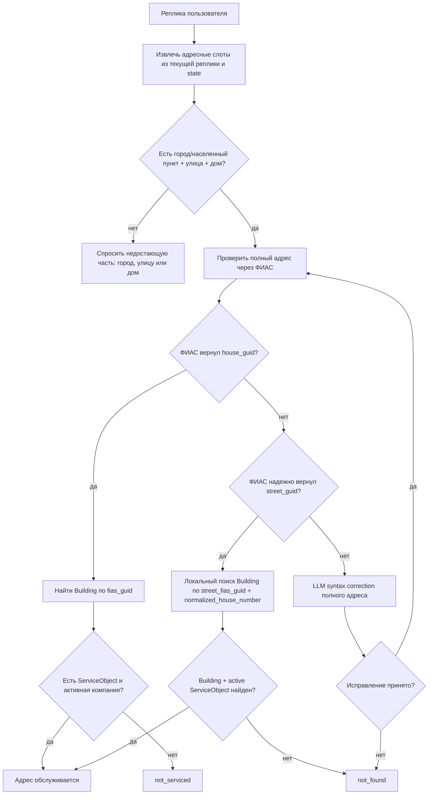

# ТЗ: адресная логика и оптимизация скорости

Статус: активное ТЗ для ближайшей реализации. Единый оркестратор фраз в эту задачу не входит.

## Цель

Собрать полный адрес из реплик пользователя, проверить его существование через ФИАС/ГАР, принять допустимые локальные исключения и определить, обслуживается ли адрес одной из компаний.

Одновременно снизить задержку за счет уменьшения лишних LLM-вызовов и повторов из-за невалидного JSON.

## Корневая Ошибка

В диалоге `347e498e-5f23-4a7c-a343-5ea28902cf2d_stt` пользователь сказал `Абрикосовая 2`.

Фактическая цепочка:

- `AddressAgent.slots` вернул `street=Абрикосовая`, `house_number=2`, `city=null`;
- адрес был неполный, но `_should_try_syntax_correction()` разрешил LLM-коррекцию;
- `_local_candidate_hints()` нашел обслуживаемый дом только по номеру дома: `Сочи, Мацестинская, 2`;
- prompt `AddressAgent.syntax_correction` передал это как реальный кандидат;
- LLM добавила `Сочи`, сохранив `Абрикосовая`;
- ФИАС нашел реальный адрес `Сочи, Абрикосовая, 2`, но он не обслуживается.

Это системная ошибка алгоритма: локальный кандидат был получен по одному номеру дома без уже найденного ФИАС ID улицы.

## Целевая Блок-Схема



## Правила Полноты

Обязательные части адреса:

- населенный пункт;
- улица;
- дом.

Если отсутствует одна или несколько обязательных частей:

- не вызывать ФИАС;
- не вызывать LLM-коррекцию;
- не вызывать `local_candidate_hints()`;
- спросить только недостающую часть.

Примеры:

- `Абрикосовая 2` -> спросить населенный пункт;
- `Сочи 2` -> спросить улицу;
- `Сочи Абрикосовая` -> спросить номер дома.

## ФИАС-Валидация

ФИАС является первым источником проверки существования полного адреса.

Сценарии:

1. ФИАС вернул `fias_house_guid`: искать локальный `Building` по `fias_guid`.
2. ФИАС не вернул `fias_house_guid`, но надежно вернул `fias_street_guid`: искать локальный дом по `street_fias_guid + normalized_house_number`.
3. ФИАС не нашел улицу или не понял полный адрес: запускать LLM-коррекцию адреса, затем повторить ФИАС.

## Локальное Исключение Для Дома Без ФИАС

Это единственный случай, когда локальный адрес может быть принят без `fias_house_guid`:

- полный адрес введен;
- ФИАС нашел улицу и вернул `fias_street_guid`;
- ФИАС не нашел точный дом;
- в локальной базе есть `Building` с тем же `street_fias_guid` и `normalized_house_number`;
- у этого `Building` есть активный `ServiceObject`;
- по `ServiceObject` находится активная компания через период обслуживания.

Любой поиск по одному номеру дома запрещен.

## LLM-Коррекция Адреса

Синтаксическая ошибка может быть в городе, улице или доме. Но LLM-коррекция запускается только после проверки полноты.

Допустимые случаи:

- `Обррикосовая 20` при полном адресе с городом;
- `Ростов на дону, Масковская, 10`;
- `Сочи, Абрикосовая, 27бэ`;
- STT склеило или исказило часть полного адреса.

Недопустимые случаи:

- `Абрикосовая 2` без города;
- `2` без улицы и города;
- `Сочи 2` без улицы.

Prompt `address-syntax-correction-runtime`:

```text
Ты исправляешь полный адрес после неудачной проверки ФИАС.

Адрес: {full_address}
Причина ФИАС: {fias_reason}
Кандидаты ФИАС по этому адресу: {fias_candidate_hints}

Правила:
- работай только с полным адресом: населенный пункт, улица, дом;
- если адрес неполный, верни action="ask_missing";
- исправляй только очевидную ошибку в городе, улице или доме;
- не добавляй город, если его не было в репликах и его не нашел ФИАС;
- не выбирай обслуживаемый адрес по одному номеру дома;
- если ФИАС нашел улицу, не меняй ее на другую;
- если уверенности нет, верни action="no_change".

Верни JSON:
{"action":"correct|ask_missing|no_change","city":null,"street":null,"house_number":null,"confidence":0.0,"reason":""}
```

## Мини-Тесты На Сложные Названия

Перед внедрением проверить LLM отдельно на кейсах:

1. `Ростов на Дону, улица Ростовская, дом 5`
2. `город Ростов, улица Московская, дом 10`
3. `Московский, улица Московская, дом 3`
4. `Ростов на дону московская 10`
5. `город Сочи, улица Обррикосовая, дом 20`
6. `Сочи, Абрикосовая, 27бэ`

Ожидание: LLM не должна дробить `Ростов на Дону` в город `Ростов` и улицу `Надону`; не должна превращать `Московский` в город `Москва`; должна исправлять только очевидные ошибки.

## Оптимизация Скорости

Текущий плохой пример: на `Абрикосовая 2` было 9 LLM-вызовов и `6284.9 ms`.

Цель:

- неполный адрес: 1 LLM-вызов максимум или 0, если слоты уже есть;
- невалидный JSON retry: стремиться к 0;
- не запускать ФИАС и syntax correction для неполного адреса;
- убрать повторный `AddressAgent.slots`, если `TurnSplitterAgent` уже вернул адресные слоты с evidence;
- использовать structured output GigaChat, если текущий API поддерживает `response_format`/JSON Schema или function calling.

## Параллельные LLM-Вызовы

В рамках этого ТЗ допустимо:

- параллелить `DialogGuardAgent.check` и `TurnSplitterAgent.analyze`, если статический guard не заблокировал реплику;
- после готового `txtPrb` параллелить независимые фильтры услуги: тип обращения, локализацию и категорию;
- ограничить параллельность через semaphore: стартово `GIGACHAT_MAX_PARALLEL_REQUESTS=6`.

Недопустимо:

- параллелить address syntax correction до проверки полноты;
- запускать локальный поиск-кандидаты до ФИАС-улицы;
- делать параллельные retry, если причина retry - невалидный prompt/schema.

## Логирование Производительности

Добавить в trace/performance:

- `pipeline_version`;
- `address_resolution_mode`;
- `missing_address_fields`;
- `fias_house_guid_found`;
- `fias_street_guid_found`;
- `local_lookup_mode`;
- `llm_call_count`;
- `llm_retry_count`;
- `invalid_json_count`;
- `prompt_slug`;
- `prompt_chars`;
- `response_chars`;
- `tokens`;
- `duration_ms`;
- `parallel_group_id`;
- `correction_action`;
- `correction_accepted`.

Сравнивать до/после:

- p50/p95 API latency;
- LLM-вызовов на один user turn;
- retry на один user turn;
- стоимость токенов;
- долю ошибочных `not_serviced`;
- долю неполных адресов, где бот задал правильный недостающий вопрос.

## Критерии Готовности

- `Абрикосовая 2` без города не подставляет `Сочи`, а спрашивает населенный пункт.
- `Сочи, Обррикосовая 20` проходит LLM-коррекцию и повторный ФИАС.
- Дом без `fias_house_guid`, но с найденной ФИАС-улицей, принимается только при совпадении `street_fias_guid + normalized_house_number`.
- Локальный поиск по одному номеру дома отсутствует.
- Невалидный JSON от GigaChat не вызывает каскад из 3-4 retry.
- В trace видно, почему выбран каждый адресный путь.
